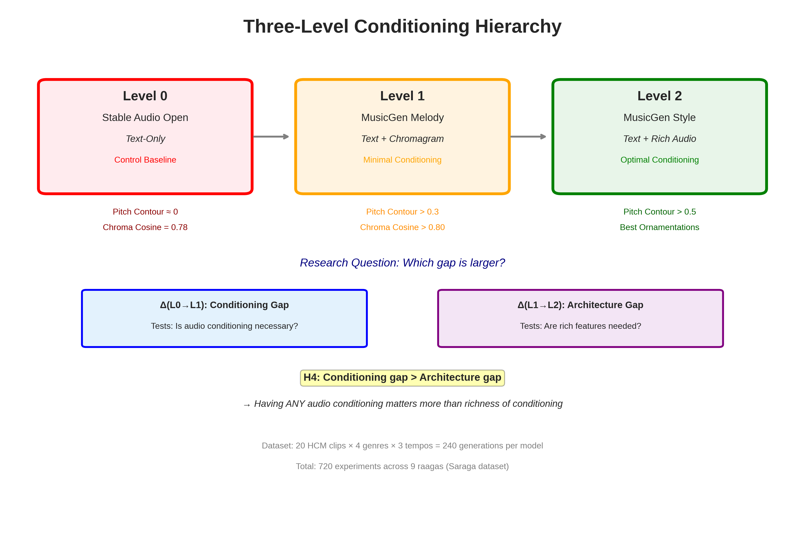

# 🎵 HCM-Western Fusion Music Generation Research

**Melody-Conditioned Cross-Cultural Music Fusion: A Systematic Study of Architectural Approaches for Hindustani Classical-Western Integration**

---

## 📋 Project Overview

This research investigates how different audio conditioning architectures preserve melodic structure when transforming Hindustani Classical Music (HCM) into Western genres (Rock, Jazz, Funk, Blues). We systematically compare three conditioning levels to understand what architectural components are necessary for cross-cultural melody preservation.

**Research Question:** What level of audio conditioning is necessary and sufficient for preserving melodic structure in cross-cultural music generation?

---

## 🎯 Research Objectives

1. **Establish necessity of audio conditioning** (vs text-only baseline)
2. **Quantify minimal viable conditioning** (pitch vs full spectral features)
3. **Measure architectural vs conditioning gaps** (Δ(L0→L1) vs Δ(L1→L2))
4. **Document semantic learning phenomena** in large-scale music models

---

## 🔬 Experimental Design

### Three-Level Conditioning Hierarchy

| Level | Model | Conditioning | Purpose |
|-------|-------|--------------|---------|
| **L0** | Stable Audio Open | Text-only | Control baseline |
| **L1** | MusicGen Melody | Text + Chromagram | Minimal conditioning |
| **L2** | MusicGen Style | Text + Rich audio | Optimal conditioning |

### Dataset
- **Source:** DS1_Saraga (Hindustani Classical Music)
- **Input clips:** 20 recordings across 9 raagas
- **Target genres:** Rock, Jazz, Funk, Blues (60 generations each)
- **Tempo conditions:** Vilambit (slow), Madhya (medium), Drut (fast)
- **Total experiments:** 720 generations (240 per model)

---

## 📊 Visual Overview

### Three-Level Conditioning Hierarchy

<p align="center">
  
  <br>
  <em>Figure 1: Three-level conditioning hierarchy showing progression from text-only to rich audio conditioning. The research question asks: which gap is larger—the jump from no conditioning to minimal conditioning (L0→L1), or from minimal to rich conditioning (L1→L2)?</em>
</p>

---

### L0 Results Summary

<p align="center">
  
  <br>
  <em>Figure 2: L0 Stable Audio results across four analyses: (A) Pitch contour centered at zero showing no melody preservation, (B) Chroma cosine skewed high revealing semantic learning, (C) Paradox cases (n=59) with high pitch class overlap but zero melodic correlation, (D) Genre-agnostic effect showing consistent metrics across all target genres.</em>
</p>

**Key Finding:** Pitch contour ≈ 0 confirms zero melody preservation (H1), but chroma cosine = 0.783 reveals unexpected semantic learning—the model learned associations between raag names and pitch classes from its training data, providing pitch vocabulary without melodic structure.

---

### Chromagram Comparison: Semantic Learning Example

<p align="center">
  
  <br>
  <em>Figure 3: Paradox case example (Experiment 543: Abhogi → Rock). Left: HCM input shows Abhogi's pentatonic melodic phrases with temporal structure. Right: Stable Audio output uses the same five pitch classes (C-D-E-G-A) but arranged as rock power chords with completely different temporal patterns. Result: 97.3% pitch class overlap (chroma cosine) with -8.5% melodic correlation (pitch contour).</em>
</p>

**Interpretation:** This demonstrates the core discovery—large-scale models develop semantic understanding of cultural music terminology (knowing which notes belong to Abhogi) separately from structural melody preservation (knowing how those notes form phrases). Text conditioning influences harmonic content; audio conditioning is needed for melodic structure.

---

## 📊 Key Results

### L0: Stable Audio Open (Text-Only) ✓ Complete

**Status:** 240/240 generations complete

**Primary Findings:**
- **Pitch Contour Correlation:** μ = -0.003 ± 0.165 → Zero melody preservation ✓ **H1 confirmed**
- **Chroma Cosine Similarity:** μ = 0.783 ± 0.099 → **Novel discovery: Semantic learning**
- **Paradox Cases:** 59/240 (24.6%) show high pitch class overlap without melodic correlation

**Key Discovery:**
Stable Audio Open learned semantic associations between raag names and pitch classes through its 800K-hour training corpus. This provides pitch vocabulary (which notes to use) but not melodic structure (how notes unfold temporally).

**Research Implication:**
Text-based semantic understanding influences harmonic content, but explicit audio conditioning is necessary for structural melody preservation. This has implications for hybrid architectures combining semantic text with structural audio features.

### L1: MusicGen Melody (Chromagram Conditioning)
*Status: Pending*

### L2: MusicGen Style (Rich Audio Conditioning)
*Status: Pending*

---

## 🔑 Research Hypotheses

- **H1:** Audio conditioning is necessary for melody preservation ✓ **CONFIRMED**
- **H2:** Chromagram is sufficient for pitch transfer *(Testing)*
- **H3:** Rich conditioning improves fidelity *(Testing)*
- **H4:** Conditioning gap exceeds architecture gap *(Testing)*

---

## 📁 Repository Structure
```
hcm_fusion_research/
├── DS1_Saraga_v1/           # Primary dataset experiments
│   ├── analysis/            # Results and metrics
│   │   └── v2_L0_SA_experiment_framework_master.csv
│   ├── outputs/             # Generated audio files
│   └── scripts/             # Generation pipelines
├── DS2_YT_v1/               # Secondary dataset (YouTube sources)
├── docs/                    # Research documentation
│   ├── analysis/            # Analysis summaries
│   └── images/              # Visualization assets
│       ├── three_level_hierarchy.png
│       ├── l0_results_summary.png
│       └── chromagram_comparison.png
└── README.md
```

---

## 🛠️ Technical Stack

**Models:**
- Stable Audio Open 1.0 (Stability AI)
- MusicGen Melody (Meta)
- MusicGen Style (Meta)

**Metrics:**
- Pitch Contour Correlation (temporal melodic preservation)
- Chroma Cosine Similarity (pitch class overlap)
- Chroma Pearson/Spearman Correlation (temporal harmonic patterns)
- Tempo Adaptation Quality (BPM matching)
- Spectral Centroid Shift (timbral transformation)

**Environment:**
- Python 3.10+
- PyTorch 2.0+
- Librosa (audio analysis)
- CUDA 11.8 (RTX 3060 12GB)

---

## 📈 Current Progress

- [x] **Week 1, Day 1:** L0 Stable Audio baseline complete (240/240)
- [ ] **Week 1, Day 2-3:** L1 MusicGen Melody generations
- [ ] **Week 1, Day 4-5:** L2 MusicGen Style generations
- [ ] **Week 2:** Comparative analysis and hypothesis testing
- [ ] **Week 3:** Paper draft and presentation prep

---

## 🎓 Research Context

**Target Audience:** Rafael Valle (Meta, Fugatto author)

**Relevance:** This research explores the boundary between semantic understanding (text-based) and structural conditioning (audio-based) in music generation models. The findings on semantic learning from cultural terminology are directly relevant to Fugatto's approach to semantic audio understanding.

---

## 📝 Citation
```bibtex
@misc{hcm_fusion_2025,
  author = {[Your Name]},
  title = {Melody-Conditioned Cross-Cultural Music Fusion: A Systematic Study of Architectural Approaches},
  year = {2025},
  url = {https://github.com/[your-username]/hcm_fusion_research}
}
```

---

## 📧 Contact

**Researcher:** [Your Name]  
**Email:** [your.email@example.com]  
**Project Duration:** October 2025 - November 2025

---

## 🙏 Acknowledgments

- **Saraga Dataset:** Indian Institute of Technology Bombay
- **Stable Audio Open:** Stability AI
- **MusicGen:** Meta AI Research
- **Target Reviewer:** Rafael Valle (Meta SuperIntelligence, Fugatto)

---

**Status:** Active Research Project | Last Updated: October 23, 2025